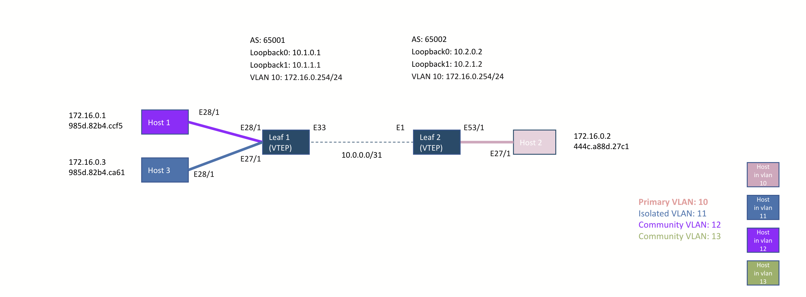

This repository has:
- PVLANs accross EVPN-VXLAN [technical presentation](PVLAN_EVPN_VXLAN.pdf)
- PVLANs accross EVPN-VXLAN configuration details and show commands output for EOS devices for diff labs:
  - [pvlan_accross_evpn_vxlan](inventories/pvlan_accross_evpn_vxlan)
  - [Secondary_VLAN_trunk](inventories/Secondary_VLAN_trunk)
  - [Promiscuous_Trunk_Workaround](inventories/Promiscuous_Trunk_Workaround)

Here's the topology details:



EVPN-VXLAN:
- Underlay: EBGP
- Overlay: EBGP (Lo0)
- VXLAN: Lo1

Here's the lab [inventory](inventories/lab/inventory.ini)

2 VTEP:
- s70512 (Leaf2)
- s70515 (Leaf1)

3 Hosts:
- s70514 (host1)
- s72811 (host2)
- s70513 (host3)


```
ansible-playbook playbooks/print_version_and_model.yml -i inventories/pvlan_accross_evpn_vxlan/inventory.ini

PLAY [print EOS version and HW model] *************************************************************************

TASK [run show version on EOS devices] ************************************************************************
Friday 11 June 2021  16:37:03 +0200 (0:00:00.026)       0:00:00.026 ***********
Friday 11 June 2021  16:37:03 +0200 (0:00:00.025)       0:00:00.025 ***********
ok: [Host3]
ok: [Leaf1]
ok: [Leaf2]
ok: [Host1]
ok: [Host2]

TASK [Print some details regarding EOS devices] ***************************************************************
Friday 11 June 2021  16:37:13 +0200 (0:00:10.316)       0:00:10.342 ***********
Friday 11 June 2021  16:37:13 +0200 (0:00:10.316)       0:00:10.341 ***********
ok: [Leaf2] =>
  msg: The device Leaf2 is a DCS-7050SX3-48YC8-F model running EOS version 4.25.3M
ok: [Host3] =>
  msg: The device Host3 is a DCS-7050CX3-32S-F model running EOS version 4.26.0.1F
ok: [Leaf1] =>
  msg: The device Leaf1 is a DCS-7050CX3-32S-F model running EOS version 4.25.3M
ok: [Host1] =>
  msg: The device Host1 is a DCS-7050CX3-32S-F model running EOS version 4.25.3M
ok: [Host2] =>
  msg: The device Host2 is a DCS-7280QR-C36-M-F model running EOS version 4.25.2F

PLAY RECAP ****************************************************************************************************
Host1                      : ok=2    changed=0    unreachable=0    failed=0    skipped=0    rescued=0    ignored=0
Host2                      : ok=2    changed=0    unreachable=0    failed=0    skipped=0    rescued=0    ignored=0
Host3                      : ok=2    changed=0    unreachable=0    failed=0    skipped=0    rescued=0    ignored=0
Leaf1                      : ok=2    changed=0    unreachable=0    failed=0    skipped=0    rescued=0    ignored=0
Leaf2                      : ok=2    changed=0    unreachable=0    failed=0    skipped=0    rescued=0    ignored=0

Friday 11 June 2021  16:37:17 +0200 (0:00:03.934)       0:00:14.277 ***********
===============================================================================
eos_command ------------------------------------------------------------ 10.32s
debug ------------------------------------------------------------------- 3.93s
~~~~~~~~~~~~~~~~~~~~~~~~~~~~~~~~~~~~~~~~~~~~~~~~~~~~~~~~~~~~~~~~~~~~~~~~~~~~~~~
total ------------------------------------------------------------------ 14.25s
Friday 11 June 2021  16:37:17 +0200 (0:00:03.935)       0:00:14.276 ***********
===============================================================================
run show version on EOS devices ----------------------------------------------------------------------- 10.32s
Print some details regarding EOS devices --------------------------------------------------------------- 3.94s
Playbook run took 0 days, 0 hours, 0 minutes, 14 seconds
---------------------------------------------------------------------------------------------------------------
```
